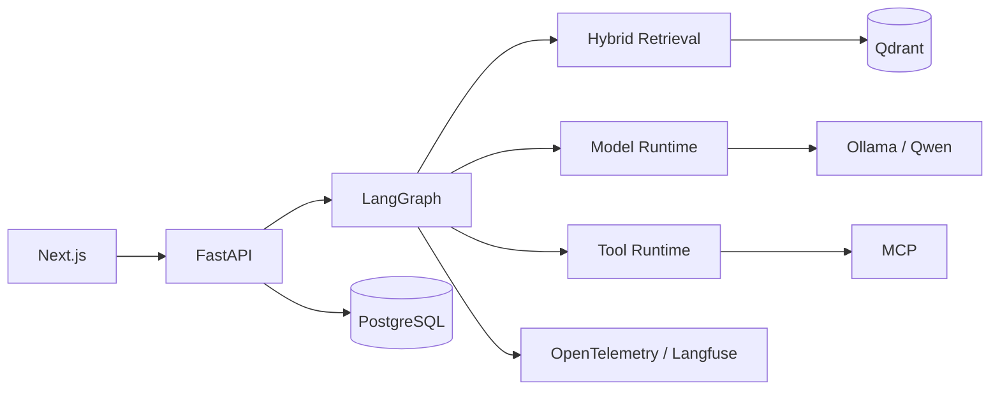

# Atlas

**An evidence-driven, locally deployable AI research agent built
around measurable retrieval quality, grounded generation,
controlled tool use, observability, and failure-aware
orchestration.**

Atlas researches uploaded documents using hybrid dense + sparse
retrieval, reranking, iterative evidence collection, citation
validation, and answer verification. Unlike a basic RAG chatbot,
the project treats retrieval, tool execution, memory,
observability, reliability, and security as first-class systems
problems.

## Why Atlas?

Most RAG demos stop at:

`question → vector search → LLM`

Atlas explores what is required to make that pipeline closer to a
production AI system:

- **Hybrid retrieval** using dense embeddings and sparse BM25
- **Cross-encoder reranking** for higher-quality context selection
- **Evaluation-first development** with Recall@K, MRR and nDCG
- **Iterative research orchestration** using bounded LangGraph loops
- **Evidence-grounded answers** with runtime citation validation
- **Answer verification and repair** before returning results
- **Policy-controlled tools** with schemas, permissions and approvals
- **MCP integration** for standardized external capabilities
- **Persistent research threads and memory**
- **OpenTelemetry/Langfuse observability**
- **Circuit breakers, deadlines and graceful degradation**
- **Prompt-injection and adversarial security tests**
- **Streaming research progress** through FastAPI SSE + Next.js
- **Reproducible Docker packaging**

## Architecture



For the detailed architecture, see
[`docs/architecture.md`](docs/architecture.md).

## Evaluation

Atlas uses a manually verified retrieval benchmark rather than
assuming additional RAG stages improve performance.

| Pipeline | Recall@5 | MRR | nDCG@5 | Mean latency |
|---|---:|---:|---:|---:|
| Dense | REAL_VALUE | REAL_VALUE | REAL_VALUE | REAL_VALUE |
| Sparse | REAL_VALUE | REAL_VALUE | REAL_VALUE | REAL_VALUE |
| Hybrid | REAL_VALUE | REAL_VALUE | REAL_VALUE | REAL_VALUE |
| Hybrid + reranker | REAL_VALUE | REAL_VALUE | REAL_VALUE | REAL_VALUE |

Full methodology and results:

[`benchmarks/atlas-v1`](benchmarks/atlas-v1)

## Reliability and Security

Atlas deliberately tests failure scenarios rather than treating
dependencies as permanently healthy.

Reliability controls include:

- bounded retries
- workflow deadlines
- circuit breakers
- concurrency limits
- retrieval degradation paths
- dependency health checks
- graph iteration limits

Security controls include:

- explicit untrusted-content boundaries
- tool permission enforcement
- human approval policy
- MCP capability allowlists
- citation validation
- memory-source restrictions
- file and resource limits
- prompt-injection regression tests

See:

- [`benchmarks/atlas-v1/reliability-results.md`](benchmarks/atlas-v1/reliability-results.md)
- [`benchmarks/atlas-v1/security-results.md`](benchmarks/atlas-v1/security-results.md)

## Technology

### Application

- Python 3.12
- FastAPI
- Pydantic
- Next.js
- TypeScript
- Tailwind CSS
- shadcn/ui

### AI

- Ollama
- Qwen3 4B
- LangGraph
- FastEmbed
- SentenceTransformers

### Retrieval

- Qdrant
- BGE dense embeddings
- sparse BM25
- Reciprocal Rank Fusion
- cross-encoder reranking

### Data and state

- PostgreSQL
- SQLAlchemy
- Alembic

### Agent capabilities

- Policy-controlled tool runtime
- Model Context Protocol (MCP)

### Evaluation and observability

- deterministic retrieval metrics
- DeepEval-compatible evaluation architecture
- OpenTelemetry
- Langfuse

### Engineering

- pytest
- Ruff
- mypy
- Docker Compose

## Quick Start

### Requirements

- Docker Desktop
- Ollama

### 1. Clone

```bash
git clone <YOUR_REPOSITORY_URL>
cd atlas
```

### 2. Install the local model

```bash
ollama pull qwen3:4b
ollama serve
```

### 3. Configure Atlas

```bash
cp .env.docker.example .env.docker
```

### 4. Start

```bash
docker compose up -d --build
```

### 5. Open

Frontend:

`http://localhost:3000`

FastAPI docs:

`http://localhost:8000/docs`

## Current Limitations

Atlas v1 is intentionally scoped as a local-first research
system.

Current limitations include:

- Optimized for a single-user local deployment
- Original uploaded PDFs are not yet stored in durable object storage
- Local model quality is constrained by the Qwen3 4B runtime
- Memory retrieval is intentionally conservative
- No public multi-tenant authentication layer yet
- No distributed job queue or horizontal model-serving architecture
- Public hosted local-LLM inference is not included

These are explicit system boundaries rather than hidden
assumptions.