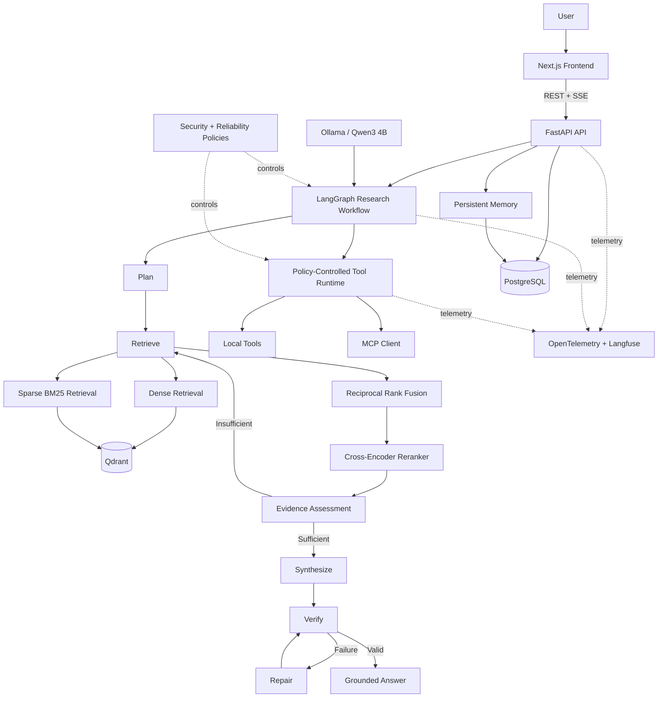
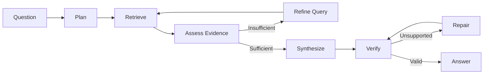

# Atlas Architecture

## Research workflow

## Architectural boundaries

### PostgreSQL vs Qdrant

PostgreSQL stores canonical application state:

- research threads
- messages
- memories
- document metadata

Qdrant stores derived retrieval state:

- dense vectors
- sparse vectors
- document chunks

### Model layer

Atlas does not couple application logic directly to Ollama.
Model providers implement a common model-client abstraction with
structured outputs, retry handling, metadata, and readiness.

### Tool layer

LLM output never grants permissions directly.

Tool execution passes through:

1. Tool lookup
2. Input validation
3. Permission enforcement
4. Approval policy
5. Timeout handling
6. Execution
7. Output validation

### Trust boundary

Retrieved documents, user input, MCP metadata, tool output,
and model output are treated as untrusted data.